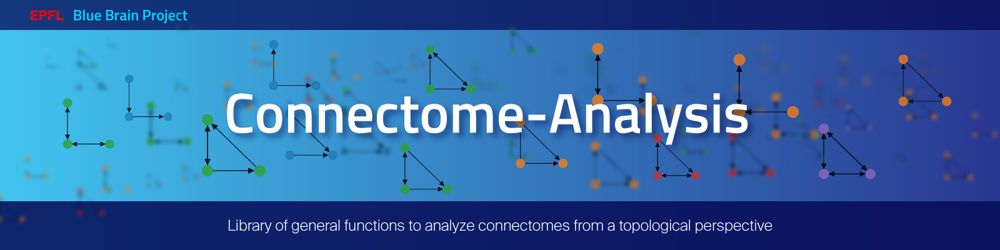

# Connectome analysis

### General analises of connectomes from a topological perspective



## Overview

This package provides a library of general functions to analyze connectomes. Functions are divided into three groups:

* [Modelling](modelling.md): Functions to model (parametrize) the connectivity of connectomes
* [Randomization](randomization.md): Generation of randomized controls of connectomes
* [Network](network.md): Network analyses based on metrics of different types


## </br> Tutorials

Check out a few short tutorials showing: 

* How to implement most
[unweighted topological network metrics.](https://github.com/danielaegassan/connectome_analysis/blob/master/tutorials/TDA_unweighted_networks.ipynb)
* How to compute 
[triad counts.](https://github.com/danielaegassan/connectome_analysis/blob/master/tutorials/counting_triads.ipynb)
* How to 
[model and extract](https://github.com/danielaegassan/connectome_analysis/blob/master/tutorials/modelling.ipynb)
distance dependent parameters from connectoms with a geometric embedding.
* How to generate 
[randomized controls of a given connectome.](https://github.com/danielaegassan/connectome_analysis/blob/master/tutorials/randomization.ipynb)

## </br> Installation 

To install, in your terminal run: 

```
pip install git+https://github.com/danielaegassan/connectome_analysis.git
```

For the installation to work you require: 

* [gcc](https://gcc.gnu.org/) 9+
* [CMake](https://cmake.org/)
* Python 3.8+

Python requirements will be installed directly and are listed 
[here](https://github.com/danielaegassan/connectome_analysis/blob/e4e23e614f95d7eab8945fcb91d0cf8ecbbe47c0/requirements.txt).

